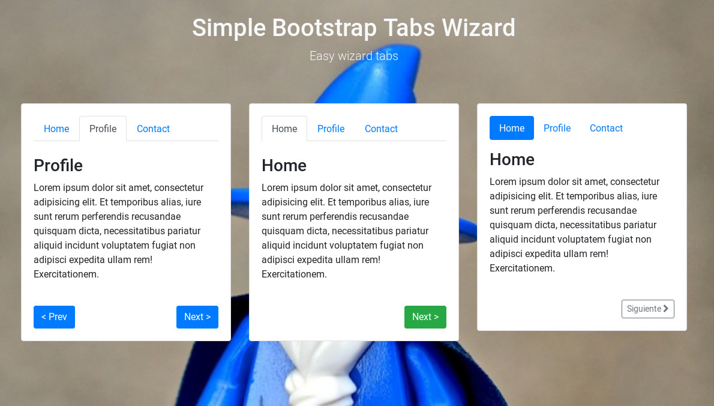

# Simple Bootstrap Tabs Wizard
Easy wizard



## Use
``` javascript
<script src="simpleWizard.js"></script>

// Normal
$("#myTab1").simpleWizard();

// All params
$("#pills-tab").simpleWizard({
  "btnClass": "btn-outline-secondary btn-sm",
  "nextText": "Siguiente",
  "prevText": "Anterior",
  "nextIcon": '<i class="fa fa-chevron-right"></i>',
  "prevIcon": '<i class="fa fa-chevron-left"></i>',
});
```
